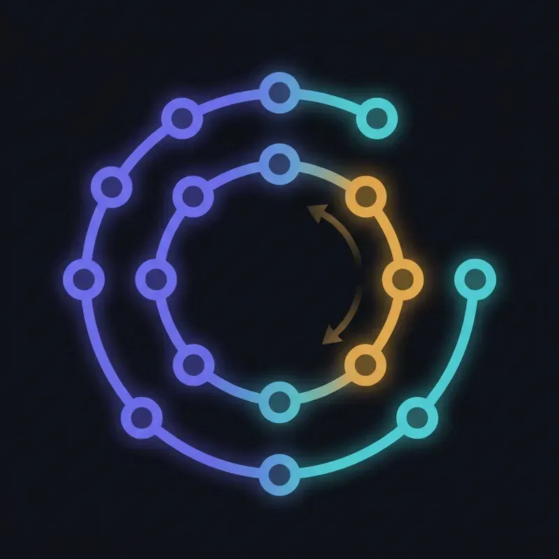

<p align="center">
  
</p>

<h1 align="center">unwind</h1>

<p align="center">
  Orchestration-based saga for distributed transactions — coordinating multi-step workflows across services, and unwinding them when a step fails.
</p>

<p align="center">
  
  
  
  
  
</p>

---

A money transfer is not one action — it is several, spread across services that each own their own data: debit the sender, credit the recipient, record the ledger entry. There is no shared database transaction to make that atomic. So what happens when the credit succeeds but the ledger write fails? **unwind** answers that question with the saga pattern: a central orchestrator drives each step forward, and when one fails, it automatically reverses the completed steps in order — refunding, reversing, restoring — until the system is consistent again.

## Why this exists

Distributed transactions are one of the problems developers most often get wrong. The temptation is to pretend a multi-service operation is atomic; the reality is that any step can fail while earlier steps have already committed. `unwind` treats that reality as the whole point — the failure paths are not an afterthought, they are the feature. You can force any step to fail and watch the compensation unwind live.

## What it does

The scenario is a transfer of funds between two accounts:

```
Transfer $100 from A to B:

  1. DEBIT A   ──►   2. CREDIT B   ──►   3. RECORD LEDGER   ──►   COMPLETED
                                                │ fails?
       REFUND A  ◄──  REVERSE CREDIT B  ◄───────┘
       (compensations run in reverse order)
```

If crediting B fails, the orchestrator refunds A. If the ledger write fails, it reverses B's credit *and* refunds A — always unwinding in the reverse of the order things happened. The orchestrator persists its state at every step, so a crash mid-saga resumes rather than corrupts.

## Patterns demonstrated

- **Orchestration-based saga** — a central coordinator owns the workflow state and decides each next step, rather than scattering the logic across services.
- **Compensating transactions** — every forward action (debit, credit) has an inverse (refund, reverse) that the orchestrator invokes on failure, in reverse order.
- **Durable saga state** — the orchestrator persists a state machine to Postgres, so an interrupted saga can recover instead of leaving money in limbo.
- **Command / reply over messaging** — the orchestrator sends commands to services over RabbitMQ and reacts to their reply events, decoupling it from any service being online at the moment.
- **Idempotency** — services safely ignore duplicate commands, since at-least-once delivery means a command may arrive more than once.
- **Deliberate failure injection** — any step can be told to fail on demand, making the compensation path observable rather than theoretical.
- **Live visualization** — a React timeline streams each state change over WebSocket, so a transfer is watched as it flows and unwinds.

## Architecture

| Module | Responsibility |
| --- | --- |
| **orchestrator** | The saga coordinator: persisted state machine, command dispatch, compensation logic, REST API, WebSocket push. |
| **account-service** | Holds balances. Performs debit / credit and their compensations (refund / reverse). |
| **ledger-service** | Records completed transfers. |
| **common** | Shared command and event contracts — the saga's vocabulary, used by every module. |
| **frontend** | React timeline: start a transfer, toggle failures per step, watch the saga advance and unwind in real time. |

The orchestrator never calls a service directly. It publishes a command to RabbitMQ, the target service acts and replies with an event, and the orchestrator advances its state machine on that reply. Each service owns its own data; consistency across them is maintained entirely by the saga.

## Saga states

The orchestrator persists a single saga instance through a linear lifecycle, with a compensation branch:

```
STARTED ─► DEBITED ─► CREDITED ─► COMPLETED
   │           │           │
   └───────────┴───────────┴──► COMPENSATING ─► FAILED
```

Advancing or compensating is a decision based on the persisted state plus the latest reply — simple, auditable, and fully owned by the orchestrator.

## Tech stack

| Layer | Choice |
| --- | --- |
| Language | Java 21 |
| Framework | Spring Boot 3.3 |
| Messaging | RabbitMQ (`spring-amqp`) |
| Persistence | PostgreSQL (Spring Data JPA) |
| Realtime | WebSocket (`spring-boot-starter-websocket`) |
| Frontend | React + Vite + TypeScript + Tailwind CSS v4 |
| Build | Multi-module Maven |
| Orchestration | Docker Compose |

## Getting started

**Prerequisites:** Java 21, Maven, Node 20+, and Docker.

**1. Start the infrastructure** (RabbitMQ, PostgreSQL):

```bash
docker compose up -d
```

**2. Build and run the backend modules** — each in its own terminal:

```bash
mvn -pl account-service spring-boot:run
mvn -pl ledger-service spring-boot:run
mvn -pl orchestrator spring-boot:run
```

**3. Run the frontend:**

```bash
cd frontend
npm install
npm run dev
```

**4. Open the dashboard** at **http://localhost:5173**.

Start a transfer, optionally toggle a step to fail, and watch the saga timeline advance — or unwind.

Useful endpoints:

- Dashboard — http://localhost:5173
- Orchestrator API + WebSocket — http://localhost:8080
- RabbitMQ management UI — http://localhost:15672

## Design decisions

- **Orchestration over choreography.** Choreography (services reacting to each other's events with no coordinator) is elegant for simple flows, but scatters the transaction logic and hides the overall state. Orchestration keeps the saga's lifecycle in one place, which is what makes the pattern legible. Choreography would be a natural second implementation.
- **Hand-rolled state machine over a library.** A money-transfer saga is a short linear sequence with a reverse compensation path — a persisted status enum and a decision function express it clearly, and keep the logic visible rather than hidden behind a framework.
- **Async messaging over synchronous REST.** Commands sit in queues and survive restarts; a briefly-offline service does not fail the transfer. This mirrors how real financial systems coordinate.

## Known simplifications

Deliberate scope choices, each with a well-understood production fix.

- **Balances are illustrative.** Accounts and balances exist to demonstrate the saga, not to model real banking (no double-entry accounting, currencies, or precision handling beyond the basics).
- **Single orchestrator instance.** Running multiple orchestrator instances would require distributed locking on saga instances; here a single instance owns each saga.
- **Compensation is assumed to succeed.** A production system must handle the harder case where a compensating action itself fails, typically via retries and a manual-intervention queue.

## Roadmap

- [ ] Step 0 — Multi-module Maven scaffold, infrastructure online
- [ ] Step 1 — Shared command/event contracts
- [ ] Step 2 — Account service (debit / credit + compensations)
- [ ] Step 3 — Ledger service
- [ ] Step 4 — Orchestrator state machine (happy path)
- [ ] Step 5 — Compensation on failure
- [ ] Step 6 — Idempotency + durable recovery
- [ ] Step 7 — REST API + WebSocket push
- [ ] Step 8 — React + Tailwind timeline UI

## License

Released under the MIT License. See [`LICENSE`](./LICENSE).